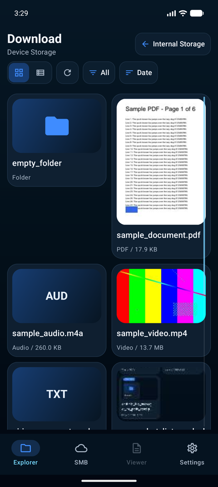
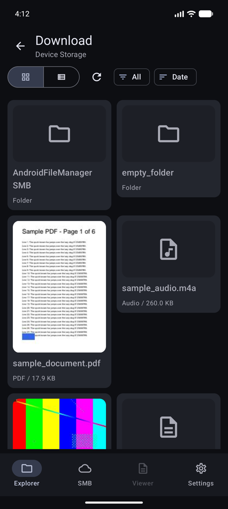
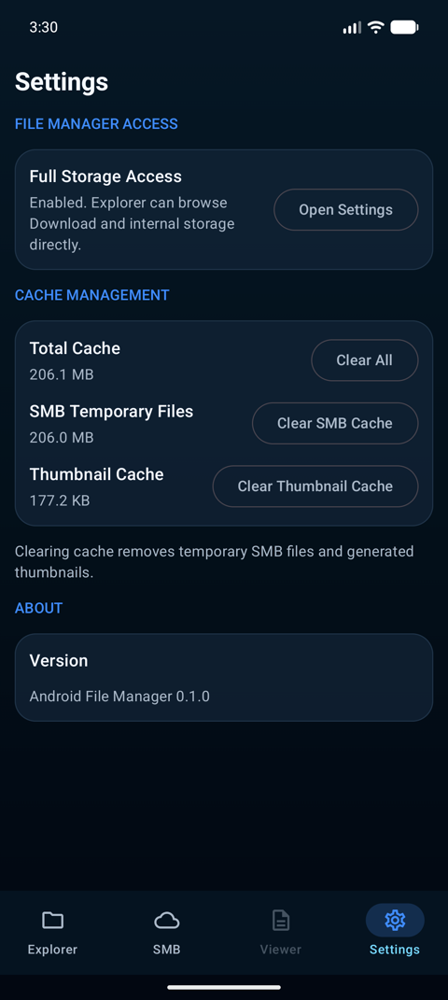
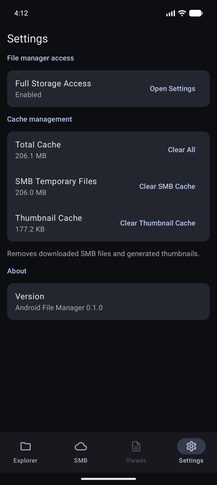
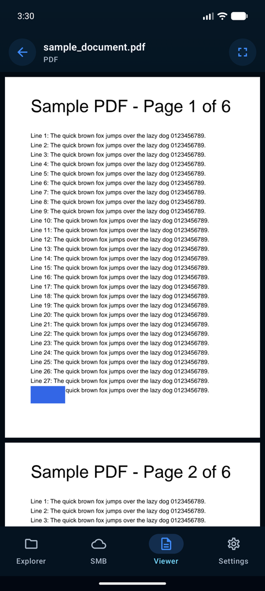
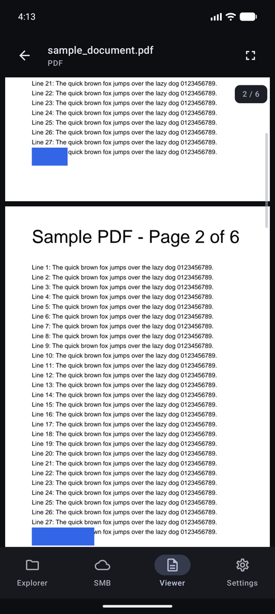
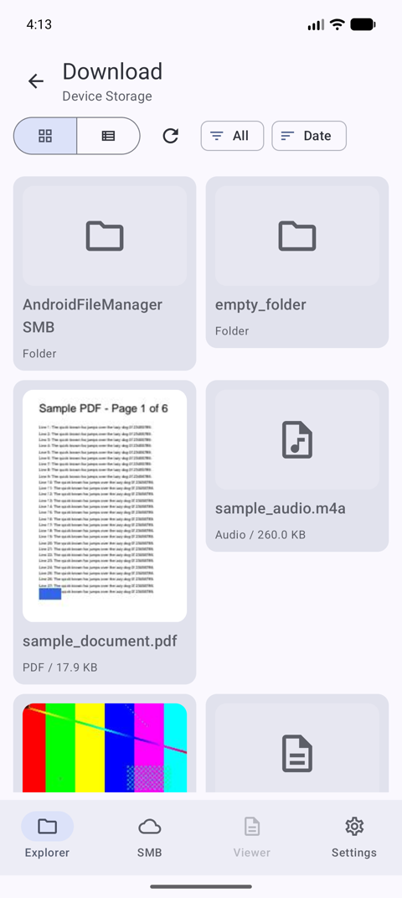
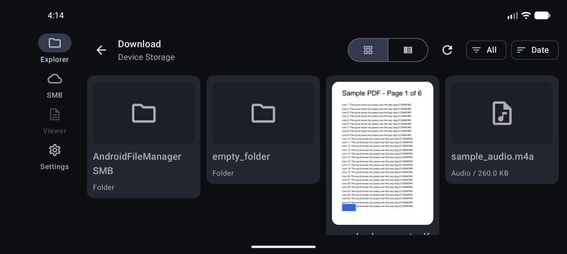

# 2026-09-21 PDF スクロールバー・SMB のテストとポート化・デザイン刷新

ユーザーからの依頼は次の 3 点。

1. PDF のプレビューにも、エクスプローラー一覧と同じ右側のスクロールバー（ドラッグで移動できるもの）を付ける
2. SMB 関連のテストと実装を行う（前回の hexagonal リファクタリングで見送った「転送のポート化」と ViewModel テスト）
3. デザインから「AI が作った風」の要素をなくす

## 1. PDF の右側スクロールバー

### 何を変えたか

- スクロールバーの描画とドラッグ検知を `ui/components/VerticalScrollbar.kt` に共通化した。エクスプローラー一覧（`explorer/FileCollection.kt`）はこれを使う薄いラッパーになり、`ScrollbarMath.kt` も `ui/components` へ移した
- PDF ビューワー（`viewer/PdfViewerScreen.kt`）の右端に同じスクロールバーを置いた。ズームで横スクロールしても右端に固定されるよう、横スクロール領域の外側に配置している
- 操作していないと 1.2 秒でフェードアウトし、スクロールかドラッグで再表示する（Android 標準のファストスクローラーと同じ挙動）。当初は PDF だけの予定だったが、デザイン刷新でエクスプローラー側もそろえた

### 位置の推定方式（なぜ index 基準ではないか）

エクスプローラーのスクロールバーは「先頭の可視アイテムの index ÷ アイテム数」で位置を出している。PDF は 1 ページがビューポートより高いことがあり、index だけでは 1 ページ内のどこにいるかを表せない。

そこで PDF では `viewer/PdfScrollMath.kt` で **ピクセル基準** の推定をする。

```
stride        = 平均ページ高さ + ページ間隔
scrollOffset  = 先頭可視ページの index × stride + 先頭可視ページ内のオフセット
contentHeight = ページ数 × 平均ページ高さ + (ページ数 - 1) × 間隔 + 上下パディング
```

平均ページ高さは **いま見えているページの平均** を使う。全ページの正確な高さを持つにはレンダリング前に全ページを計測する必要があり、大きな PDF で開くのが遅くなるため採らなかった。サイズが混在する PDF ではサム位置に多少のずれが出るが、ドラッグ時は毎回「目標オフセット → (index, ページ内オフセット)」に戻して `scrollToItem` するので、操作が破綻することはない。

### テスト

先にテストを書き、未実装によるコンパイル失敗（Red）を確認してから実装した。

| テスト | 件数 | 見ているもの |
|---|---|---|
| `ui/components/ScrollbarMathTest`（追加分） | 6 | ピクセル指標の境界（収まるなら null、先頭 0 / 末尾 1、サム下限 0.08、往復整合） |
| `viewer/PdfScrollMathTest` | 7 | 推定オフセットと内容高さ、往復整合、末尾・負値・0 件の丸め |

### 動作確認（エミュレータ Pixel 10 Pro）

- 6 ページの PDF でフリック中に右端へバーが出て、止まると消える
- バーを末尾までドラッグすると 6 / 6 ページへ移動し、ページ番号ピルも追従する

## 2. SMB のテストとポート化

### 背景

前回のレビューで「`SmbExplorerViewModel` が `SmbFileSource` / `SmbConnectionPool` / `FileManagerAccess` / `SystemClock` を直接持っており、接続〜転送の状態遷移をユニットテストできない」「`onCleared()` でサムネイル生成のスコープと接続プールを閉じていない」が指摘され、見送っていた。

### 何を変えたか

```
core / application / port
  FileTransfer        download(files, onProgress) / upload(sources: List<String>, remoteDir, onProgress)
  SmbShareAccess      = FileSource + FileTransfer（接続済み共有への操作）
  SmbShareConnector   connect(info): SmbShareAccess / disconnectAll()
core / application
  DownloadEntriesUseCase(transfer, canWriteDownloads)  未選択・保存先書き込み不可を例外で弾く
  UploadEntriesUseCase(transfer)                        送信元が空なら弾き、現在のフォルダを宛先にする
core / domain
  TransferSummary(fileCount, destinationPath)

app
  SmbFileSource : SmbShareAccess          （downloadToDownloads / uploadFromUris を port の名前に）
  DefaultSmbShareConnector                 connect = SmbFileSource 生成、disconnectAll = 接続プールを非同期に閉じる
  SmbExplorerViewModel(smbClient, connectionStore, shareConnector, thumbnailRepositoryFactory, canWriteDownloads, progressThrottle)
  ThumbnailRepository.close()              ワーカーコルーチンの停止。両 ViewModel の onCleared から呼ぶ
```

- `upload` の入力を `Uri` ではなく文字列にしたのは、core に Android の型を持ち込まないため。`Uri` への変換は `SmbFileSource` の中だけで行う
- `disconnectAll()` が非 suspend なのは `onCleared()` から呼ぶため。`onCleared()` の時点で `viewModelScope` は既にキャンセル済みなので、実装側（`DefaultSmbShareConnector`）が専用スコープで非同期に閉じる
- 進捗の反映は `viewModelScope.launch` を挟まず `StateFlow.update` で直接行うように変えた。`update` は CAS で原子的なので IO スレッドから呼んで問題なく、launch を挟むと「転送完了で進捗を消す」更新より後に古いフレームが届いて残留し得る

### テスト（先に書いて Red を確認 → 実装で Green）

| テスト | 件数 | 見ているもの |
|---|---|---|
| `core` `DownloadEntriesUseCaseTest` | 4 | 未選択・書き込み不可で転送を呼ばない、選択順の維持、進捗の受け渡し |
| `core` `UploadEntriesUseCaseTest` | 3 | 空なら弾く、現在フォルダ／ルートの宛先 |
| `app` `smb/SmbExplorerViewModelTest` | 12 | 保存済み接続の読込、接続と保存 1 回、階層移動と戻る、失敗表示、開く、ダウンロードの検証・進捗・完了、アップロード後の再読込、切断、破棄時の後始末 |

ViewModel テストは in-memory の fake（`SmbShareConnector` / `SmbShareAccess` / `SmbConnectionRepository` / `ThumbnailRepository`）だけで動き、Android の実行環境を要求しない。

進捗の観測は Turbine ではなく「進捗通知の直後に `uiState.value` を読む」方式にした。`StateFlow` は最新値しか保持せず、同期的に完了する転送では途中の状態が合流して見えなくなるため。

### 動作確認

- エミュレータから NAS へ接続し、1.3 KB のテキストファイルを長押し選択 → ダウンロード。端末の `Download/AndroidFileManager SMB/<host>_<share>/` に保存され、完了メッセージが出て選択が解除されることを確認
- アップロードは NAS への書き込みになるためエミュレータでは実行せず、ユースケースと ViewModel のテストで確認した

## 3. デザイン刷新

### 何が「AI っぽかった」か

変更前の画面には、生成系ツールが作る管理画面によく見られる要素がそろっていた。

- 濃紺の縦グラデーション背景と、発光するような青（`#3F8CFF` / `#76D8FF` / `#74D0FF`）の直書き
- すべてのカード・ボタンに 1dp の枠線と半透明の面、14〜20dp の大きな角丸
- 大文字のセクションラベル（"FILE MANAGER ACCESS"、"CONNECTED" と緑の点）
- サムネイル背景の青→紺グラデーションと、拡張子を大文字で大きく出す占位表示（"AUD" / "TXT"）
- 押すとわずかに縮む独自アニメーションと、独自実装のボタン群
- 冗長な説明文

### 方針: 装飾を足さず、Material 3 をそのまま使う

| 項目 | 変更前 | 変更後 |
|---|---|---|
| 配色 | ダーク固定・色の直書き | 端末のライト / ダーク設定に従う。Android 12 以降は Dynamic Color（壁紙由来）、それ未満は Material 3 の既定配色 |
| 背景 | グラデーション | `background` の単色 |
| 面と枠線 | 半透明の面 + 1dp 枠線 | `surfaceContainer*` の段階だけで表現。枠線なし |
| 角丸 | 14〜20dp の直書き | `MaterialTheme.shapes` |
| ボタン | 独自 Surface + `pressScale` | `IconButton` / `FilledTonalIconButton` / `TextButton` / `AssistChip` / `SegmentedButton` |
| 一覧の行 | 枠線付き Surface | `ListItem`（選択中は `secondaryContainer`） |
| サムネイル占位 | グラデーション + 拡張子テキスト | `surfaceContainerHigh` + 種類ごとの Material アイコン |
| SMB 接続表示 | "CONNECTED" + 緑の点 | `ListItem`（`host / share` と "Connected"） |
| Settings | 大文字ラベル、枠線カード | 文頭のみ大文字の `titleSmall`、`ListItem` + `TextButton` |
| ナビゲーション | 色の直書き | `NavigationBar` / `NavigationRail` の既定 |
| スクロールバー | シアンの発光色、常時表示 | `onSurfaceVariant`、スクロール中とドラッグ中だけ表示（Android 標準のファストスクローラーと同じ） |

`grep -rn "Color(0x\|BorderStroke\|Brush\.\|pressScale" app/src/main/java` が 0 件になることを確認した。残した例外は、全画面再生時の黒背景（`Color.Black`）と動画上のスクリム（`scrim`）、PDF ページ面の白だけ。

### 変更前後（エミュレータ Pixel 10 Pro、ダークテーマ）

| 画面 | 変更前 | 変更後 |
|---|---|---|
| Explorer |  |  |
| Settings |  |  |
| PDF |  | （スクロール中。右端にバー、右上にページ番号） |

ライトテーマ: 

横向き（ナビゲーションレール）: 

SMB 画面のスクリーンショットは、接続先の IP アドレスや NAS 上のフォルダ名が写るため、公開リポジトリには含めていない。

## レビュー（review-worker / opus）と対応

| 重大度 | 指摘 | 対応 |
|---|---|---|
| 重大 | 自動で隠れるスクロールバーが、非表示中も幅 24dp の領域でタップを奪い、一覧右端の項目をタップしても開かない | 非表示中は `pointerInput` 自体を外す。Compose は重なった兄弟要素のうち最前面でヒットしたものにだけタッチを配るため、consume しないだけでは下のカードに届かなかった（エミュレータで確認）。「非表示でもサムの位置なら掴める」案も試したが、内容がわずかにはみ出すだけの一覧ではサムがトラックの大半を占めるため効果がなく、Android 標準と同じ「スクロールで出してから掴む」に決めた |
| 中 | Activity テーマがライト固定で、ダーク設定の起動時に白くフラッシュする | `values-night/themes.xml` を追加（appcompat が無いので night 修飾子で切替） |
| 中 | ダウンロードの検証失敗時に「読み込み中」を戻すため直前の状態を退避しており回りくどい。開始メッセージの件数も選択数と転送数でずれる | `DownloadEntriesUseCase` に `onStarted(count)` を追加し、検証通過後に開始状態を立てる（テスト先行） |
| 中 | `disconnectAll()` が単一の接続プールを閉じるため、再生や転送の途中で切断すると巻き込む | 変更前からの挙動で今回の差分による退行ではないため見送り。接続プールを ViewModel 単位にするときに合わせて直す |
| 中 | 選択中の `ListItem` で文字色が面色に追従しない | `onSecondaryContainer` を指定 |
| 中 | ライトテーマで PDF ページと背景がほぼ同色。ダークテーマで白い紙面の上のサムが見えない | 背景を `surfaceContainerHighest` に。PDF のサムは紙面が常に白なので固定色（UI 規約の例外として明記） |
| 中 | 「Removes downloaded SMB files」が Download フォルダのファイルを消すと誤読される | 文言修正 |
| 軽微 | 未使用の `BrowseLabelButton`・`NavigateUpAction.label`・`IconDescriptor` の文字列・app の Turbine 依存 | 削除 |
| 軽微 | ViewModel テストの進捗観測が「進捗通知直後のフック」で実装のタイミングに結合している | 見送り。`StateFlow` の合流で Turbine では途中状態を観測できないため、現時点ではこの方式が最も壊れにくいと判断 |

## 検証コマンド

```powershell
.\gradlew.bat assembleDebug testDebugUnitTest :core:test
```

## 残課題

- PDF の位置推定は均一高さの近似。サイズが大きく混在する PDF で気になるようなら、レンダリング済みページの実測高さを累積する方式に置き換える
- `ExplorerViewModel` にはまだ ViewModel テストがない（SAF / `DocumentFile` 依存の切り出しが必要）
- 実機での確認は未実施
